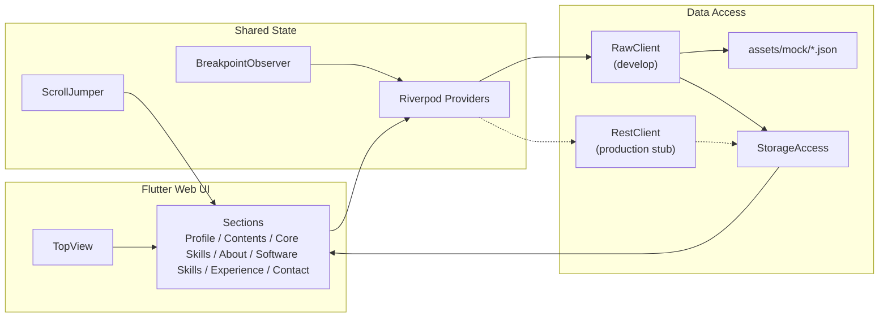

# tiwa-cc.github.io

Flutter Web で構築しているポートフォリオサイトです。  
ヒーローヘッダ、イントロ、代表的な取り組み、強み、進め方、対応技術、バックグラウンド、連絡先を 1 ページで表示し、画面幅に応じてレイアウトを切り替えます。

2026-04-07 時点のユーザー向けセクションは `Profile`、`Contents`、`Core Skills`、`About`、`Software Skills`、`Experience`、`Contact` です。  
ヘッダーには `xs` / `sm` 幅で全セクションへのジャンプメニューがあり、全幅共通で言語切替と開発用のレイアウト幅プレビュー切替があります。

現時点では `About`、`Contents`、`CoreSkill`、`SoftwareSkill`、`Experience` がアセット JSON を経由してデータを読み込みます。  
実 API、永続化、本文コンテンツの一部はまだダミー実装です。

## 技術スタック

- Flutter 3 / Dart 3.8
- Riverpod 2
- `flutter_layout_grid` によるレスポンシブレイアウト
- `flutter_svg` による SVG アセット表示
- `dio` + `retrofit` による API 抽象
- `freezed` + `json_serializable` によるモデル生成

## ブランドアセット方針

このプロジェクトはレスポンシブ実装そのものをポートフォリオとして見せる意図があるため、ブランド表現に関わる静的文字素材は可能な限り `SVG` を使います。

- `assets/original/`
  フォントを残した編集元 SVG
- `assets/`
  Web 配信用の path 化済み SVG
- `lib/res/asset_*.dart`
  UI 上の表示サイズと縦横比の管理

`title.svg` と `subtitle.svg` は「文字がキャンバスをしっかり使う source SVG」を作り、その後の見た目の大小は Flutter 側で調整します。  
詳細は [docs/assets.md](docs/assets.md) を参照してください。

## アーキテクチャ概要

実装は大きく 4 層に分かれています。

- `lib/app`
  アプリ全体の構成、画面セクション定義、レスポンシブ切り替えを担当します。
- `lib/features`
  Intro / Featured Work / Strengths / Capability / Background / Contact などの UI コンポーネント群です。
- `lib/infrastructure`
  API クライアント、Repository、Storage の抽象と実装を置いています。
- `lib/shared`
  Riverpod Provider、`ThemeExtension` ベースの共有テーマ、共通 Widget、ブレークポイントやスクロール制御をまとめています。

共有スタイルは `AppThemeData` と `AppThemeExtensions` に集約しています。  
現在は `AuthorNameTheme`、`HeaderViewButtonTheme`、`InfoCardTheme`、`CopyrightTheme`、`HeaderPopupMenuTheme` を `ThemeExtension` として登録し、feature 側は `Theme.of(context).extension<T>()` 経由で参照します。

`main()` では `FLAVOR` が `develop` のときだけ `RawClient` と `RawAccessor` を注入し、`assets/mock/*.json` を疑似 API として扱います。  
これらの mock JSON は `pubspec.yaml` の `flutter.assets` に `assets/mock/` を明示登録しており、Web ビルドでは `build/web/assets/assets/mock/` 配下へ展開されます。  
`TopView` は初回表示時と locale 切替時に全データをまとめて再取得し、`timeout -> 自動再試行 -> 失敗時は全体エラー表示` の制御を行います。  
本番向けの `RestClient` と `DBAccessor` は雛形のみで、まだ実運用状態ではありません。



## 主要ディレクトリ

```text
.
├── assets/                 画像・SVG・サンプル JSON
├── docs/                   設計・ロードマップ・課題メモ
├── lib/
│   ├── app/                画面全体の構成とレスポンシブ制御
│   ├── features/           セクション別 UI
│   ├── infrastructure/     API / Storage / Repository
│   ├── domain/             ドメインモデル
│   ├── res/                アセットラッパ
│   └── shared/             Provider・ThemeExtension・共通 Widget
├── test/                   Widget test・asset test
├── web/                    Flutter Web エントリ
└── build_web.sh            Web ビルド用スクリプト
```

## セットアップ

### 1. 依存解決

```bash
flutter pub get
```

### 2. 生成コードの更新

このリポジトリは `freezed`、`json_serializable`、`retrofit` を使っています。  
モデルや API を変更した場合は再生成が必要です。

```bash
flutter pub run build_runner build --delete-conflicting-outputs
```

### 3. 開発起動

`main.dart` は `FLAVOR=develop` を既定値にしているため、特に指定しなければアセットベースの疑似データで起動します。

```bash
flutter run -d chrome
```

本番用フレーバを試す場合は次のように指定します。

```bash
flutter run -d chrome --dart-define=FLAVOR=production
```

ただし、`production` 側は `DBAccessor` が未実装で、`RestClient` の接続先もダミー URL のままです。

## Web ビルド

付属のスクリプトは WebAssembly ビルドとローカル実行をまとめています。

```bash
./build_web.sh
```

中身は以下の 2 コマンドです。

```bash
flutter build web --wasm --no-source-maps
flutter run -d web-server
```

### GitHub Pages

- 公開 URL は `https://tiwa-cc.github.io/` です。
- GitHub Pages の公開パスは `/` です。
- GitHub Actions では `flutter build web --wasm --base-href /` を使ってデプロイしています。
- mock JSON はビルド成果物では `assets/assets/mock/` に配置され、アプリ側では `lib/res/asset_path.dart` 経由で参照します。

## 実装状況

### 実装済み

- 1 ページ構成のポートフォリオ UI
- `xs` から `xl` までのレスポンシブレイアウト切り替え
- ヘッダーの開発用レイアウト幅プレビュー切り替え
- SVG ベースのブランドアセット運用とヘッダモーション
- Riverpod による依存注入
- 初回ロード時の timeout / 自動再試行 / 全体エラーオーバーレイ
- `ProfilePanel` の hero 表示とアクセシビリティ対応
- `About`、`CoreSkill`、`SoftwareSkill`、`Experience`、`Contents` のサンプル JSON 読み込み
- `SoftwareSkillsPanel` の capability snapshot 表示と icon catalog
- `Contents` の featured work カード表示と外部導線
- セクション単位のスクロールジャンプとアクティブ判定
- `ExperiencePanel`、`ProfilePanel`、`TopView` などの主要 Widget test

### 未実装または仮実装

- `DBAccessor` による永続化
- `RestClient` を使う実 API 接続
- Contact の一部リンク遷移
- レスポンシブ全体のゴールデンテストと統合テスト
- Flutter 標準生成ベースの多言語対応

## ドキュメント

- [docs/README.md](docs/README.md)
- [docs/architecture.md](docs/architecture.md)
- [docs/assets.md](docs/assets.md)
- [docs/api-design.md](docs/api-design.md)
- [docs/state-machine.md](docs/state-machine.md)
- [docs/decisions.md](docs/decisions.md)
- [docs/roadmap.md](docs/roadmap.md)
- [docs/anomaly-detection.md](docs/anomaly-detection.md)

## 注意点

- `docs/` の内容は、2026-04-07 時点の実装をもとに整理しています。
- 既存コードにはプレースホルダや TODO が残っているため、README の説明は「現状の仕様」を優先しています。
- `dartdoc_options.yaml` は `doc/README.md` を参照していますが、この README 群は `docs/` に置いています。生成ドキュメントを整える場合は参照先の見直しが必要です。
