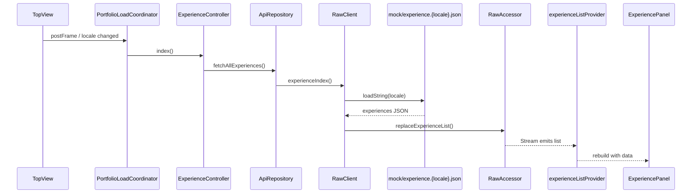
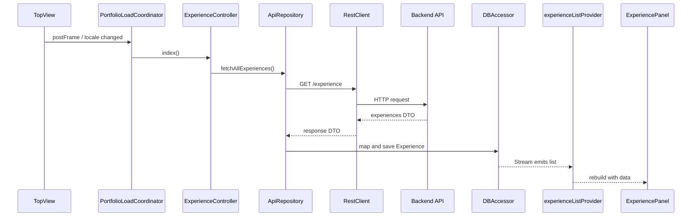
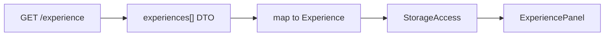

# API Design

## 対象

現状、このプロジェクトで API として明示的に設計されているのは `about`、`contents`、`coreSkill`、`softwareSkill`、`experience` の read 系取得です。  
現行の `SeverApiInterface` は `index()` 相当のメソッドだけを持ち、更新系 API はまだ定義していません。

## 抽象レイヤ

### 1. API Interface

`lib/infrastructure/communicate/sever_api_interface.dart`

- `SeverApiInterface`
  API クライアントの抽象
- `AboutRequest` / `AboutResponse`
  About 取得用の DTO
- `ContentRequest` / `ContentResponse`
  Contents 一覧取得用の DTO
- `CoreSkillRequest` / `CoreSkillResponse`
  CoreSkill 一覧取得用の DTO
- `SoftwareSkillRequest` / `SoftwareSkillResponse`
  SoftwareSkill 一覧取得用の DTO
- `ExperienceRequest`
  一覧取得用のリクエスト DTO
- `ExperienceResponse`
  一覧取得用のレスポンス DTO

現状の `AboutResponse`、`ContentResponse`、`CoreSkillResponse`、`SoftwareSkillResponse`、`ExperienceResponse` は `id` しか持たず、UI が必要とする実体を返していません。  
これは本来の最終形ではなく、`RawClient` がストレージ更新を副作用として実行しているために成立している暫定設計です。

### 2. Repository

`lib/infrastructure/repository/api_repository.dart`

- `ApiRepository.fetchAllExperiences()`
  `SeverApiInterface.experienceIndex()` を呼び出し、`ApiResponse` に包んで返す
- `ApiRepository.fetchAbout()`
  `SeverApiInterface.aboutIndex()` を呼び出す
- `ApiRepository.fetchAllContents()`
  `SeverApiInterface.contentIndex()` を呼び出す
- `ApiRepository.fetchAllCoreSkills()`
  `SeverApiInterface.coreSkillIndex()` を呼び出す
- `ApiRepository.fetchAllSoftwareSkills()`
  `SeverApiInterface.softwareSkillIndex()` を呼び出す

Repository は薄いラッパに留まっており、DTO からドメインモデルへの変換責務をまだ持っていません。

### 3. Controller

`lib/app/interface/experience_controller_interface.dart`

- `ExperienceController.index()`
  Repository を呼び出すだけのオーケストレータ
- `AboutController.index()`
  Repository を呼び出すだけのオーケストレータ
- `ContentController.index()`
  Repository を呼び出すだけのオーケストレータ
- `CoreSkillController.index()`
  Repository を呼び出すだけのオーケストレータ
- `SoftwareSkillController.index()`
  Repository を呼び出すだけのオーケストレータ

将来的には、ここで API 結果の成否判定や再試行方針を扱う余地があります。

### 4. Storage

`lib/infrastructure/storage/storage_access_interface.dart`

- `watchExperienceList()`
  UI 向けの購読口
- `watchAbout()`
  About の購読口
- `watchContentEntryList()`
  Contents 一覧の購読口
- `watchCoreSkillList()`
  CoreSkill 一覧の購読口
- `watchSoftwareSkillList()`
  SoftwareSkill 一覧の購読口
- `replaceExperienceList()`
  一覧更新の受け口
- `replaceAbout()`
  About 更新の受け口
- `replaceContentEntryList()`
  Contents 一覧更新の受け口
- `replaceCoreSkillList()`
  CoreSkill 一覧更新の受け口
- `replaceSoftwareSkillList()`
  SoftwareSkill 一覧更新の受け口

UI は Storage のストリームを通して About、Contents、Skill、職歴一覧を受け取ります。

## 現在の実データフロー

### 開発モード



```text
ExperiencePanel
  -> experienceListProvider watches RawAccessor stream

TopView initial load
  -> PortfolioLoadCoordinator.load()
  -> ExperienceController.index()
  -> ApiRepository.fetchAllExperiences()
  -> RawClient.experienceIndex()
  -> assets/mock/experience.{ja,en}.json を読み込む
  -> Experience.fromJson()
  -> RawAccessor.replaceExperienceList()
  -> Stream 更新
  -> ExperiencePanel が再描画
```

`RawClient` が「通信」と「ストレージ更新」の両方を行うため、責務分離はまだ中途半端です。  
ただし UI プロトタイプを早く回す用途としては軽量です。

`TopView` は `About`、`Contents`、`CoreSkill`、`SoftwareSkill`、`Experience` の取得を並列実行し、各 task に timeout を設定しています。  
timeout 時は 1 回だけ自動再試行し、それでも失敗した場合は `PortfolioLoadErrorView` を重ねて再読み込み導線を出します。

`About` は `aboutIndex()` から `assets/mock/about.{ja,en}.json`、`Contents` は `contentIndex()` から `assets/mock/content_showcase.{ja,en}.json`、`CoreSkill` は `coreSkillIndex()` から `assets/mock/core_skill.{ja,en}.json`、`SoftwareSkill` は `softwareSkillIndex()` から `assets/mock/software_skill.json` を読み込みます。  
`Experience` は `experienceIndex()` から `assets/mock/experience.{ja,en}.json` を読み込みます。

### 本番モードの想定



```text
ExperienceController
  -> ApiRepository
  -> RestClient(Dio/Retrofit)
  -> HTTP GET /experience
  -> DTO 受信
  -> Domain model 変換
  -> DBAccessor or in-memory store 更新
  -> StreamProvider から UI へ通知
```

この経路は未完成です。特に以下が不足しています。

- `RestClient` の実 URL と実レスポンススキーマ
- DTO から `About` / `ContentEntry` / `CoreSkill` / `SoftwareSkill` / `Experience` への変換
- `DBAccessor` 実装
- エラー処理、ローディング、空状態の扱い

## 推奨レスポンス形

将来的には、一覧 API は次のような構造に寄せると実装しやすいです。



```json
{
  "experienceAreas": [
    {
      "title": "Web・バックエンド・クラウド開発",
      "summary": "フルスタックに一貫対応",
      "startedAt": "2009-01-01",
      "endedAt": "2026-03-31",
      "highlights": ["要件整理から運用改善まで担当"],
      "technologies": ["Laravel", "Flutter", "AWS"]
    }
  ]
}
```

この形なら `assets/mock/experience.{ja,en}.json` と本番 API のスキーマを揃えやすく、`RawClient` と `RestClient` の差分を縮小できます。公開ポートフォリオでは、案件一覧より技術領域サマリを返す方が扱いやすいです。

## 現状の API 設計上の論点

### 良い点

- API 抽象があり、開発用実装と本番用実装を差し替えられる
- UI が HTTP 依存を直接持っていない
- `About`、`ContentEntry`、`CoreSkill`、`SoftwareSkill`、`Experience` のモデルは JSON 変換まで整っている

### 課題

- `AboutResponse` / `ContentResponse` / `CoreSkillResponse` / `SoftwareSkillResponse` / `ExperienceResponse` が UI 要件と一致していない
- `RawClient` がストレージ更新まで担っている
- `ApiResponse.response` が `Object?` のため型安全性が弱い
- CRUD の大半が未実装

## 次の改善候補

1. `AboutResponse` / `ContentResponse` / `CoreSkillResponse` / `SoftwareSkillResponse` / `ExperienceResponse` を実 DTO に置き換える
2. `ApiRepository` で DTO から各 Domain model に変換する
3. `RawClient` は JSON を返すだけにして副作用を外へ寄せる
4. `DBAccessor` を実装し、Storage を統一的な流入口にする
