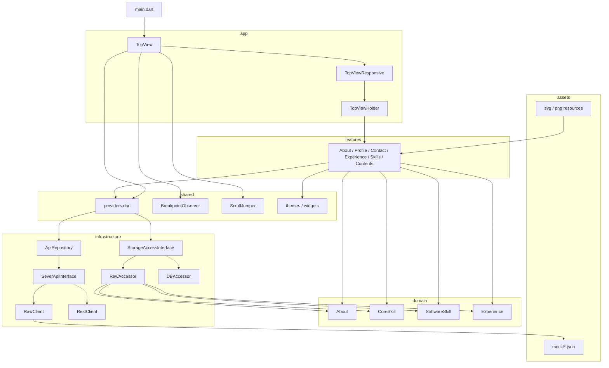
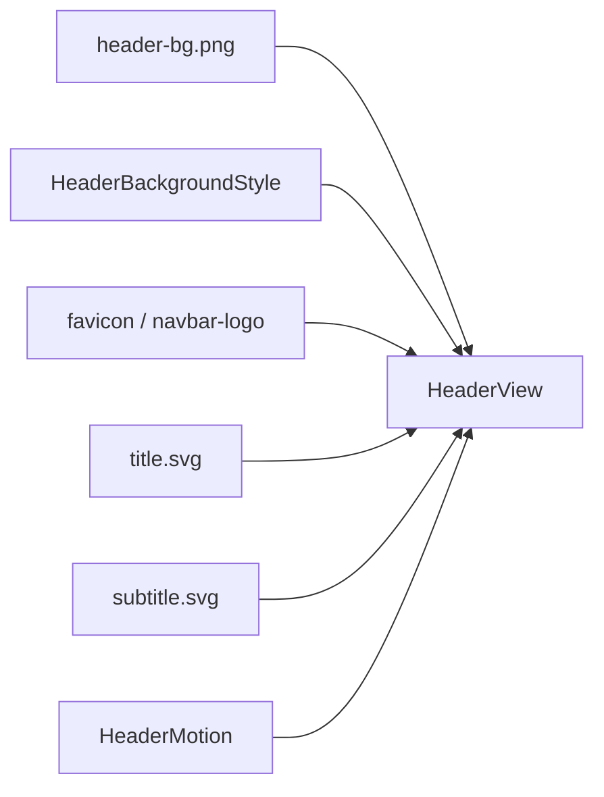
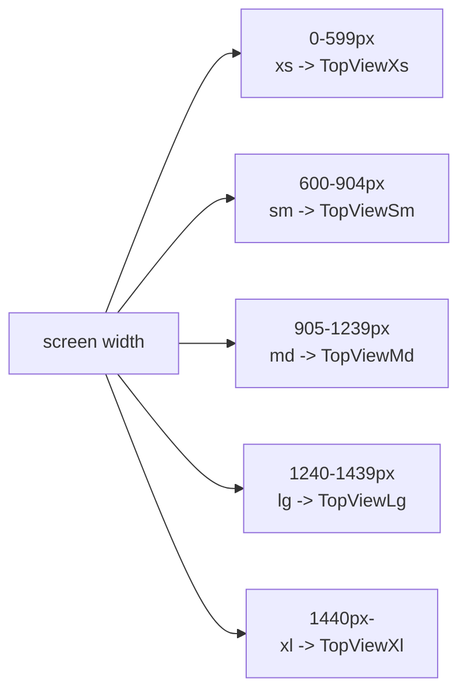

# Architecture

## 目的

このアプリは、Flutter Web でポートフォリオを 1 ページ表示するための UI シェルです。  
単一画面の中に複数セクションを並べ、画面幅ごとにレイアウト構成を差し替えます。

## レイヤ構成



### `lib/main.dart`

- `ProviderScope` を起点に依存性を注入します。
- `String.fromEnvironment('FLAVOR')` により、開発時は `RawClient` と `RawAccessor` を使います。

### `lib/app`

- `TopView` が `MaterialApp` とトップページを構築します。
- `TopView` は初回表示時の post-frame と locale 変更時に、全セクションのデータ取得をまとめて起動します。
- `TopView` は `PortfolioLoadCoordinator` を通して `timeout -> 自動再試行 -> 失敗時は全体エラー表示` を制御します。
- `Section` enum でセクションの識別子を統一しています。
- 現在レイアウトに載るユーザー向けセクションは `profile`、`contents`、`coreSkills`、`about`、`softwareSkills`、`experience`、`contact` です。
- `TopView` は `visibleNavigationSections()` からヘッダー用ジャンプ対象を組み立て、`xs` / `sm` では全セクションジャンプメニュー、`md` 以上では utility action のみを出します。
- `TopViewResponsive` が `Breakpoint` に応じて `TopViewXl` から `TopViewXs` を切り替えます。
- `TopViewHolder` が `Section` と対応 Widget の組み立てを担当します。
- `LayoutWidthFrame` が開発用プリセット幅を適用し、`BreakpointObserver` に見せる `MediaQuery.size` を切り替えます。
- ヘッダーの utility action として `LayoutWidthDropdownButton` と `LocaleToggleButton` を持ちます。

### `lib/features`

- セクション単位の見た目を担当します。
- `ProfilePanel`、`AboutPanel`、`ContactPanel`、`ExperiencePanel`、`CoreSkillPanel`、`SoftwareSkillsPanel`、`ContentsPanel` が主な構成要素です。
- `ProfilePanel` は似顔絵、肩書き、短い価値提案、フォーカスチップをまとめた intro / hero block です。
- `ProfilePanel` は profile 画像に image semantics、ハンドル名に header semantics を付けています。
- `ContentShowcase` は独立セクションではなく、`ContentsPanel` の中で public repo README ベースの `content_showcase.[ja/en].json` 由来 featured work カードと外部リンクを表示します。
- `header` feature には `HeaderView`、`HeaderMotion`、`HeaderPopupMenu`、`SectionViewButton` があり、ヒーローヘッダの描画と `xs` / `sm` 向けセクションジャンプ UI を担当します。
- `footer` feature は `FooterView` に責務を絞り、コピーライト文字列とブランドワードマークでページ末尾を閉じます。
- 背景写真のレスポンシブなトリミングは `HeaderBackgroundStyle` が担当します。
- `AboutPanel` は `aboutProvider` を購読し、進め方の段落を card 化して表示します。`{{username}}` のような置換トークンも継続して解決できます。
- `CoreSkillPanel` は 2 カラムまで拡張する strength card 群として表示し、箇条書きではなく要点をカード単位で見せます。
- `SoftwareSkillsPanel` は `software_skill_catalog.dart` の icon rule を利用しつつ、`Primary Stack` などの capability snapshot に再構成して表示します。
- `ExperiencePanel` は年月順の InfoCard 群ではなく、背景領域ごとの card と technology chip で見せます。
- `ContactPanel` は list tile ではなく action 群として公開連絡先を表示します。

### Header Hero

ヒーローヘッダは、背景画像・ブランドシンボル・ワードマーク・サブタイトルを 1 つの `SliverAppBar` 内で制御します。



- `HeaderView`
  Widget の配置と描画を担当
- `HeaderMotion`
  スクロール率から位置、サイズ、opacity を計算
- `HeaderBackgroundStyle`
  ブレークポイントごとの背景写真のズーム量と見せる位置を計算
- `HeaderPopupMenu`
  `xs` / `sm` 幅で `visibleNavigationSections()` を並べるジャンプ UI
- `SectionViewButton`
  `Section` とローカライズ済みタイトルからヘッダー内のジャンプボタンを組み立てる

現在の挙動は次の通りです。

- `favicon` は expanded 状態から AppBar 左上へ移動しながら縮小する
- `title` は後半でフェードアウトする
- `subtitle` は早い段階で縮小しながらフェードアウトする
- `xs` / `sm` では `PROFILE` など大文字ラベルのポップアップメニューから各セクションへスクロールできる
- `md` / `lg` / `xl` では utility action のみを表示する

### `lib/shared`

- `shared/providers.dart` に Riverpod Provider を集約しています。
- `BreakpointObserver` が `MediaQuery.size` を監視し、現在のブレークポイントを Provider に反映します。
- `LayoutWidthFrame` により、開発時は `Auto / XS / SM / MD / LG / XL` のプリセット幅で `MediaQuery.size` を強制できます。
- `ScrollJumper` mixin がセクションごとの GlobalKey とスクロール制御を管理します。
- `InfoCard`、`CardTitle`、`IconLabel` などの共通 UI を提供します。
- `AppThemeExtensions` は `AuthorNameTheme`、`HeaderViewButtonTheme`、`InfoCardTheme`、`CopyrightTheme`、`HeaderPopupMenuTheme` を登録し、custom style は `ThemeExtension` 経由で解決します。
- `activeLocaleProvider` が実効ロケールを解決し、`TopView` が locale 変更時の再取得トリガを持ちます。
- `layoutWidthPresetProvider` が開発用レイアウト幅プリセットを保持します。
- `aboutProvider`、`contentEntryListProvider`、`coreSkillListProvider`、`softwareSkillListProvider`、`experienceListProvider` が各セクションの snapshot を View に供給します。

### `lib/infrastructure`

- `SeverApiInterface` が API 抽象です。
- `RestClient` は Retrofit ベースの HTTP 実装です。
- `RawClient` はロケール別のアセット JSON を読み込む疑似 API 実装です。
- `ApiRepository` は API 抽象をラップします。
- `StorageAccessInterface` は UI が参照するストレージ抽象です。
- `RawAccessor` はメモリ内ストリームで、ロード済み最新値を late subscriber に再送します。
- `RawClient` は locale 切替中の古い読み込み結果を破棄し、現在 locale の値だけを storage に反映します。
- `DBAccessor` は将来の永続化置き場です。
- `About`、`Contents`、`CoreSkill`、`Experience` は locale 別 mock JSON から取得し、storage 経由で UI に渡します。`Contents` の元文面は public repo README をもとに管理しています。
- `SoftwareSkill` は locale 非依存の単一 mock JSON から取得し、presentation 層でカテゴリやアイコンを解決します。
- `pubspec.yaml` では `assets/mock/` を明示登録しており、Web ビルド成果物では `assets/assets/mock/` に展開されます。
- `lib/res/asset_path.dart` が画像と mock JSON の実行時パス解決を共通化します。

### `lib/domain`

- `About`、`CoreSkill`、`SoftwareSkill`、`Experience` が現在の主要ドメインモデルです。
- `freezed` と `json_serializable` により不変モデルと JSON 変換を実現しています。

## 依存関係

データの流れは次の通りです。

```text
TopView
  -> post frame / locale changed
  -> PortfolioLoadCoordinator.load()
  -> AboutController.index()
  -> ContentController.index()
  -> CoreSkillController.index()
  -> SoftwareSkillController.index()
  -> ExperienceController.index()
  -> ApiRepository
  -> SeverApiInterface
  -> RawClient or RestClient
  -> StorageAccessInterface
  -> aboutProvider(StreamProvider)
  -> contentEntryListProvider(StreamProvider)
  -> coreSkillListProvider(StreamProvider)
  -> softwareSkillListProvider(StreamProvider)
  -> experienceListProvider(StreamProvider)
  -> AboutPanel / ContentsPanel / CoreSkillPanel / SoftwareSkillsPanel / ExperiencePanel
  -> failed の場合は PortfolioLoadErrorView
```

重要なのは、`AboutPanel`、`ContentsPanel`、`CoreSkillPanel`、`SoftwareSkillsPanel`、`ExperiencePanel` が API の戻り値を直接読まず、`StorageAccessInterface` のストリームだけを見る点です。  
このため、API 実装差し替えと UI は比較的疎結合です。

一方で、responsive 切替や locale 切替で Widget が張り直されても loading に戻りにくいよう、`RawAccessor` は最新値を再購読者へ返します。

## レスポンシブ構成

### ブレークポイント



- `xs`: 0 - 599px
- `sm`: 600 - 904px
- `md`: 905 - 1239px
- `lg`: 1240 - 1439px
- `xl`: 1440px 以上

### 開発用幅プリセット

- `Auto`
  実ブラウザ幅をそのまま使う
- `XS`
  375px
- `SM`
  768px
- `MD`
  1024px
- `LG`
  1280px
- `XL`
  1600px

### レイアウト方針

- `xl` / `lg`
  2 カラム構成で、`Profile -> About -> Featured Work -> Strengths / Capability -> Background -> Contact` を主軸に配置します。
- `md`
  上段に `Profile` と `About` を 1:1 で並べ、その下に `Contents` を全幅で置きます。続いて `Core Skills` と `Software Skills`、次に `Experience`、最後に `Contact` を並べます。
- `sm`
  単一カラム寄りの縦積みに寄せ、`Profile -> Contents -> Core Skills -> About -> Software Skills -> Experience -> Contact` の順に並べます。主要セクションの後ろには `ScrollToHeadButton` を差し込みます。
- `xs`
  `sm` と同じ順序を維持した単一カラムに変換します。ページ末尾の `Contact` の下にも `ScrollToHeadButton` を置きます。

## 状態管理

Riverpod の Provider は限定的です。

- `routeObserverProvider`
  画面表示イベントの監視用
- `localeOverrideProvider` / `activeLocaleProvider`
  実効ロケールの保持と切り替え
- `layoutWidthPresetProvider`
  開発用レイアウト幅プリセット
- `breakpointSizeProvider`
  現在の画面サイズとブレークポイント
- `topViewScrollPositionProvider`
  将来用のスクロール位置保持。現状ほぼ未使用
- `aboutProvider`
  ストレージの `watchAbout()` を購読
- `contentEntryListProvider`
  ストレージの `watchContentEntryList()` を購読
- `coreSkillListProvider`
  ストレージの `watchCoreSkillList()` を購読
- `softwareSkillListProvider`
  ストレージの `watchSoftwareSkillList()` を購読
- `experienceListProvider`
  ストレージの `watchExperienceList()` を購読
- `aboutControllerProvider`
  About データ更新のトリガ
- `contentControllerProvider`
  Contents データ更新のトリガ
- `coreSkillControllerProvider`
  CoreSkill データ更新のトリガ
- `softwareSkillControllerProvider`
  SoftwareSkill データ更新のトリガ
- `experienceControllerProvider`
  Experience データ更新のトリガ
- `serverApiProvider`
  API 実装の差し替え点
- `storageAccessProvider`
  ストレージ実装の差し替え点

## アセット構成

- `assets/*.svg`, `assets/*.png`
  ヘッダやプロフィールなどの静的素材
- `assets/original/*.svg`
  フォント情報を残した編集元 SVG
- `assets/mock/about.{ja,en}.json`
  開発時のロケール別 About サンプル
- `assets/mock/content_showcase.{ja,en}.json`
  開発時のロケール別 Contents データ。public repo README ベースの featured work を保持
- `assets/mock/core_skill.{ja,en}.json`
  開発時のロケール別 CoreSkill サンプル
- `assets/mock/software_skill.json`
  開発時の locale 非依存 SoftwareSkill サンプル
- `assets/mock/experience.{ja,en}.json`
  開発時のロケール別 Experience サンプル
- `lib/res/*`
  アセットパスと Widget 化を隠蔽するラッパ

mock JSON は source 上では `assets/mock/*` にあり、Flutter Web のビルド後は `build/web/assets/assets/mock/*` に配置されます。  
実行時コードは `lib/res/asset_path.dart` を通して `assets/mock/*` を解決するため、画像と JSON で同じルールを使います。

### SVG ブランド素材の扱い

ブランド表現に関わる文字素材は、可能な限り `SVG` で扱います。

- source of truth は `assets/original/`
- Web 配信用成果物は `assets/`
- UI 上の表示サイズと縦横比は `lib/res/asset_*.dart`

`title.svg` と `subtitle.svg` は「文字がキャンバスをしっかり使う」source SVG を作り、表示サイズの大小は Flutter 側に寄せます。  
`title.svg` はヒーローヘッダだけでなく、Footer の小さいワードマークにも再利用しています。  
運用詳細は [assets.md](assets.md) を参照してください。

## 現状の特徴

- 画面構成は比較的整理されており、`About`、`Contents`、`CoreSkill`、`SoftwareSkill`、`Experience` は JSON 駆動で表示できます。
- Provider による依存注入は入っているものの、アプリ全体の状態はまだ増えていません。
- `SoftwareSkill` は data と presentation rule を分離し、icon / category / subheader 表示を UI 側で制御しています。
- 実 API と永続化の本番パスは未完成で、現状は UI プロトタイプ寄りの構成です。
