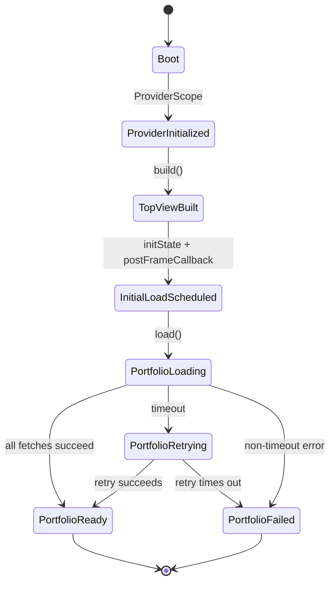
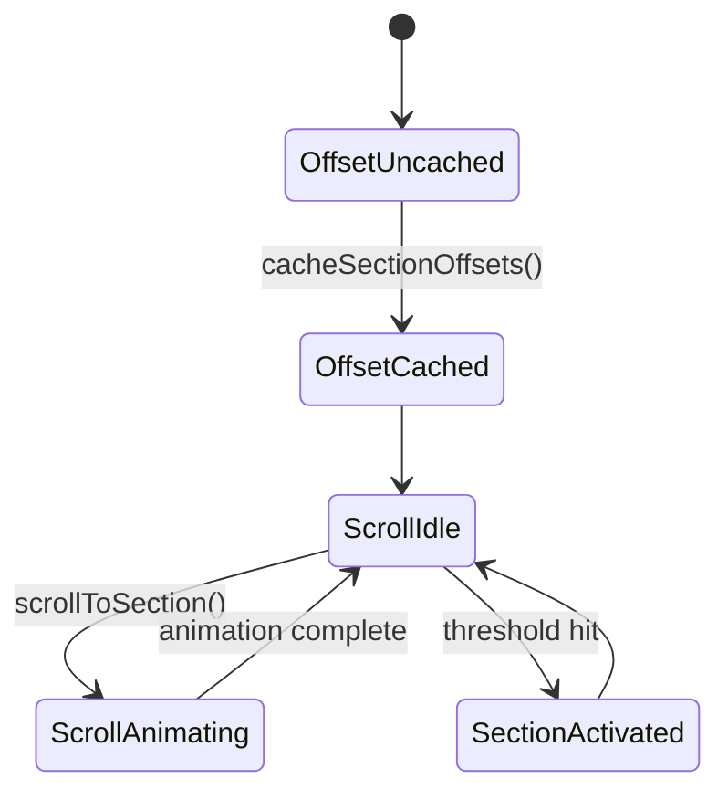
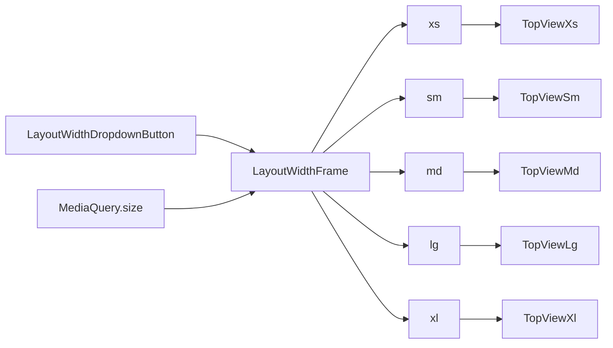

# State Machine

## 目的

このドキュメントでは、厳密なオートマトンではなく、画面初期化と表示更新の主要な状態遷移を整理します。  
対象は `TopView`、`ExperiencePanel`、`ScrollJumper`、`BreakpointObserver` です。

## 1. アプリ起動時

### 状態

- `boot`
- `provider_initialized`
- `top_view_built`
- `initial_load_scheduled`
- `portfolio_loading`
- `portfolio_retrying`
- `portfolio_ready`
- `portfolio_failed`

### 遷移



```text
boot
  -> ProviderScope initialized
  -> TopView build
  -> MaterialApp / Scaffold created
  -> TopView.initState
  -> postFrameCallback
  -> PortfolioLoadCoordinator.load()
  -> About / Contents / CoreSkill / SoftwareSkill / Experience を並列取得
  -> portfolio_loading
```

その後、`serverApiProvider` の実装に応じて分岐します。

```text
portfolio_loading
  -> RawClient succeeds
  -> RawAccessor stream emits latest snapshots
  -> portfolio_ready

portfolio_loading
  -> timeout
  -> portfolio_retrying

portfolio_retrying
  -> RawClient succeeds
  -> RawAccessor stream emits latest snapshots
  -> portfolio_ready

portfolio_retrying
  -> timeout or exception
  -> PortfolioLoadErrorView
  -> portfolio_failed
```

## 2. ExperiencePanel の描画状態

`ExperiencePanel` は `StreamProvider` の `AsyncValue` を直接描画します。

### 状態

- `loading`
- `data`
- `error`

### 表示ルール

- `loading`
  `CircularProgressIndicator`
- `data`
  `InfoCard` を件数分描画
- `error`
  ローカライズ済みの固定メッセージ

### 問題点

- 空配列時は Empty State を出すが、リトライ導線はまだない
- `error` が例外内容を出さない
- セクション単位の `error` と、`TopView` 全体の load failure overlay が別経路で存在する

## 3. スクロール状態

`TopView` は `ScrollJumper<Section>` を mixin し、各セクションの GlobalKey を保持します。

### 状態

- `offset_uncached`
- `offset_cached`
- `scroll_idle`
- `scroll_animating`
- `section_activated`

### 遷移



```text
TopView.initState
  -> initScrollJumper()
  -> offset_uncached

post frame / breakpoint height change
  -> cacheSectionOffsets()
  -> offset_cached

button tap
  -> scrollToSection(section)
  -> scroll_animating

scroll listener
  -> nearest section within threshold
  -> section_activated
```

`section_activated` の実処理は、各セクション Widget の `activate()` / `deactivate()` を呼ぶ想定ですが、現在のコードベースではそれを完全に受ける全 Widget 実装が見えていません。したがって、この仕組みは構想先行の状態です。

## 4. レスポンシブ状態

`BreakpointObserver` が `LayoutWidthFrame` 適用後の `MediaQuery.size` を監視し、`breakpointSizeProvider` を更新します。



### 状態

- `xs`
- `sm`
- `md`
- `lg`
- `xl`

### 遷移条件

- `0 <= width < 600` -> `xs`
- `600 <= width < 905` -> `sm`
- `905 <= width < 1240` -> `md`
- `1240 <= width < 1440` -> `lg`
- `1440 <= width` -> `xl`

### 影響

- ヘッダのアクション表示が切り替わる
- `TopViewResponsive` の Widget が差し替わる
- レイアウト変更後に `cacheSectionOffsets()` が再実行される
- 開発時は `Auto / XS / SM / MD / LG / XL` のプリセット幅を強制できる

## 5. Contact の外部遷移

`ContactPanel` では一部の項目が `launchUrl()` を実行します。

### 状態

- `idle`
- `launching`
- `launched`

### 備考

- `http` / `https` / `mailto` の URI を持つ項目だけが `launchUrl()` を実行する
- X アカウントは常時表示される
- メールアドレスと LinkedIn は設定済みの場合のみ表示される
- 位置情報は情報表示専用で、外部遷移は持たない

## まとめ

現状の状態遷移は単純ですが、以下の 2 系統がアプリの中心です。

1. 画面初期表示時と locale 切替時に主要セクションのデータをロードしてストリーム更新する流れ
2. 画面幅とスクロール位置に応じてレイアウトとアクティブセクションを切り替える流れ

今後、実 API と永続化を入れるなら、現在 `TopView` が持つ portfolio 単位の loading / retry / failed 制御を Riverpod Notifier などへ寄せると、テストしやすくなります。
